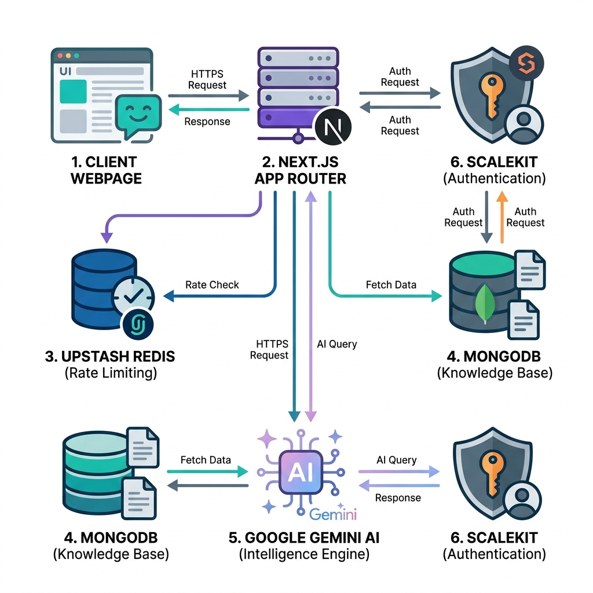
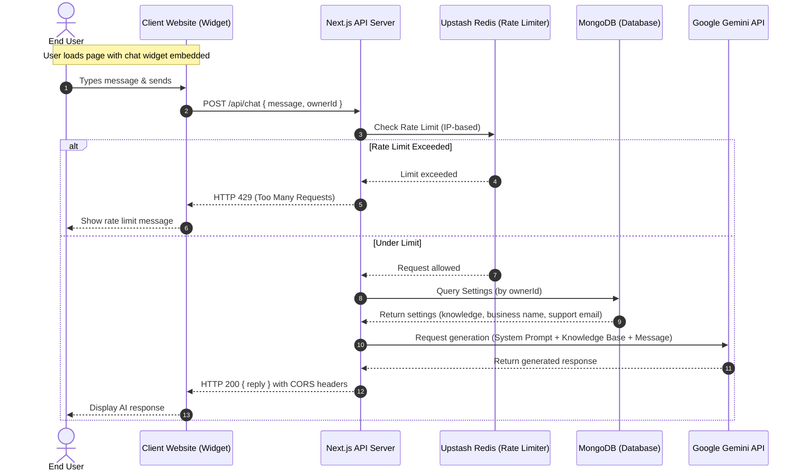
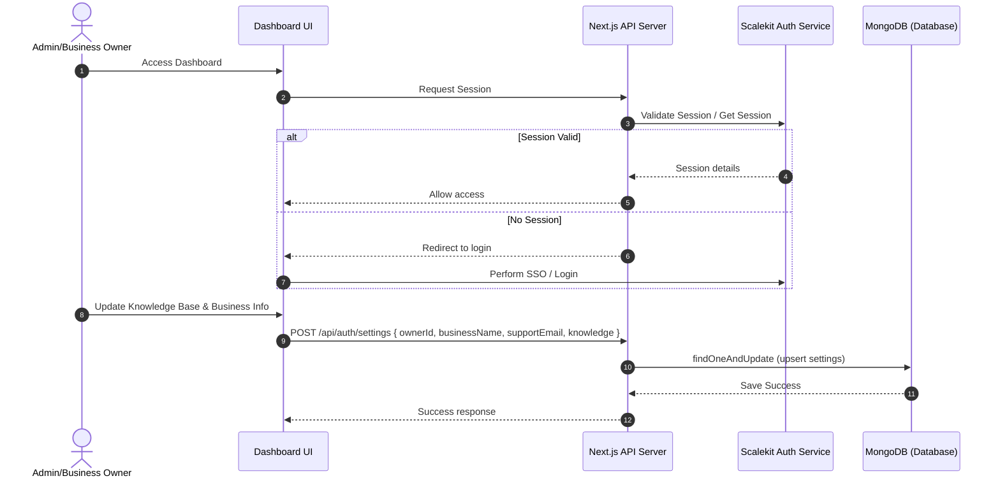

# Support.ai - AI Customer Support Chatbot

An embeddable AI customer support chatbot built with Next.js, Google Gemini, and Scalekit.

## Features

-   **Embeddable**: Easily embed the chatbot on any website using a simple `<script>` tag.
-   **AI-Powered**: Uses Google's Gemini Flash model for intelligent, context-aware responses.
-   **Customizable**: Train the bot with your own specific business data and knowledge base.
-   **Dashboard**: Manage your business details and knowledge base through a user-friendly dashboard.
-   **Authentication**: Secure login and management via Scalekit.

## Tech Stack

-   **Framework**: Next.js 14+ (App Router)
-   **Language**: TypeScript
-   **AI Model**: Google Gemini 1.5 Flash
-   **Auth**: Scalekit SDK
-   **Database**: MongoDB (via Mongoose)
-   **Rate Limiting**: Upstash Redis
-   **Styling**: Tailwind CSS
-   **Icons**: Lucide React

## Architecture & Workflow

Support.ai utilizes a clean, modern decoupled architecture to support fast real-time chat interactions while maintaining secure dashboard administrative operations.

### System Architecture Diagram



### Core Workflows

#### 1. End-User Chat Bot Widget Flow
The embedded script handles UI rendering in the client's browser, rate-limiting is checked on the server using Upstash Redis, and responses are generated via the Google Gemini 2.5 Flash model grounded with customer-specific business settings from MongoDB.



#### 2. Administrative Dashboard Management Flow
Business owners manage their chatbot details and knowledge base training through a secure panel guarded by Scalekit SSO authentication.



## Setup & Local Development

1.  **Clone the repository**:
    ```bash
    git clone https://github.com/your-username/ally-support.git
    cd ally-support
    ```

2.  **Install dependencies**:
    ```bash
    npm install
    ```

3.  **Environment Variables**:
    Create a `.env.local` file in the root directory and add the following:
    ```env
    # Scalekit (Auth)
    SCALEKIT_ENVIRONMENT_URL=your_scalekit_url
    SCALEKIT_CLIENT_ID=your_client_id
    SCALEKIT_CLIENT_SECRET=your_client_secret

    # MongoDB
    MONGODB_URL=your_mongodb_connection_string

    # Google Gemini
    GEMINI_API_KEY=your_gemini_api_key

    # Upstash Redis (Rate Limiting)
    UPSTASH_REDIS_REST_URL=your_upstash_rest_url
    UPSTASH_REDIS_REST_TOKEN=your_upstash_rest_token

    # App URLs
    NEXT_PUBLIC_APP_URL=http://localhost:3000
    NEXT_PUBLIC_BASE_URL=http://localhost:3000
    ```

4.  **Run the development server**:
    ```bash
    npm run dev
    ```
    Open [http://localhost:3000](http://localhost:3000) with your browser.

## Deployment on Vercel

1.  Push your code to a GitHub repository.
2.  Import the project into Vercel.
3.  **Crucial Step**: Add the Environment Variables in Vercel settings.
    *   **NEXT_PUBLIC_APP_URL**: Set to your deployed URL (e.g., `https://ally-support.vercel.app`) - **No trailing slash**.
    *   **NEXT_PUBLIC_BASE_URL**: Set to your deployed URL (e.g., `https://ally-support.vercel.app`) - **No trailing slash**.
    *   Add all other secret keys (`MONGODB_URL`, `GEMINI_API_KEY`, `SCALEKIT_...`).
4.  Deploy!

## How to Embed the Chatbot

1.  Go to your deployed Dashboard.
2.  Click on "Embed Code".
3.  Copy the script tag.
4.  Paste it before the closing `</body>` tag of your website's HTML.

```html
<script 
    src="https://ally-support.vercel.app/chatBot.js" 
    data-owner-id="your_unique_owner_id">
</script>
```
